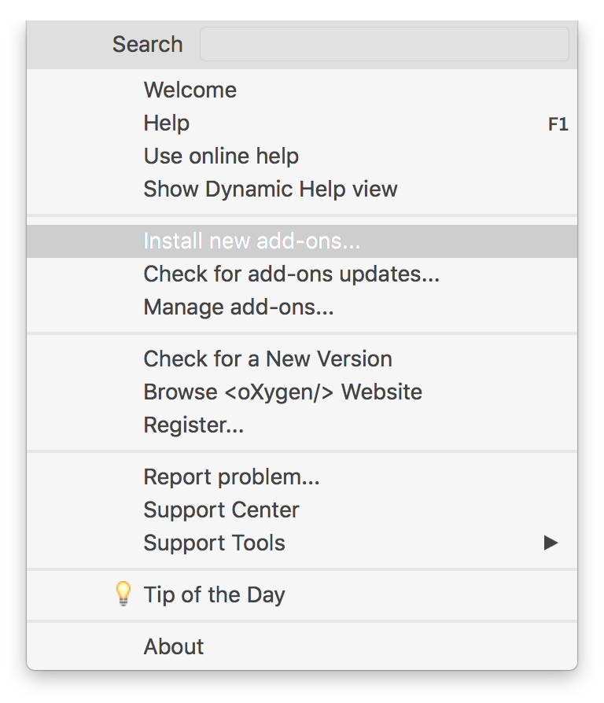
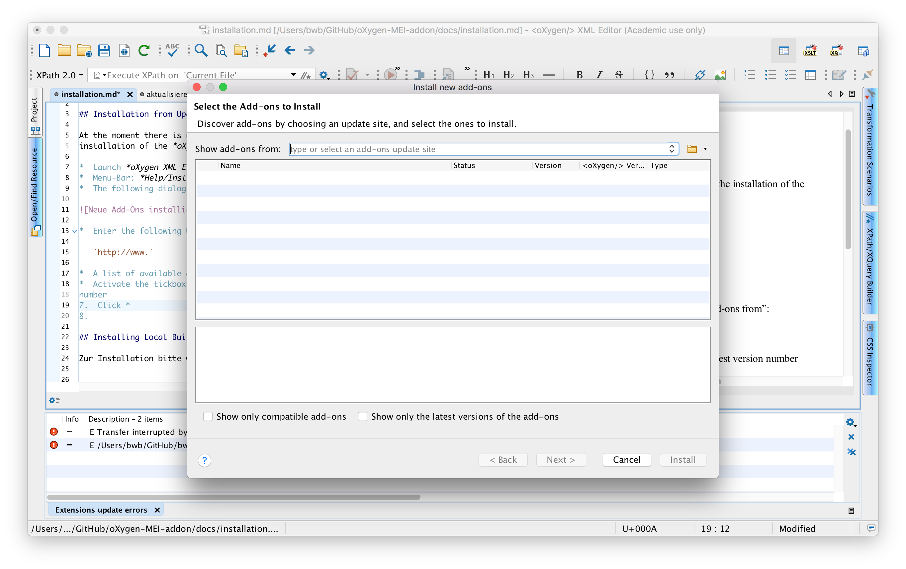
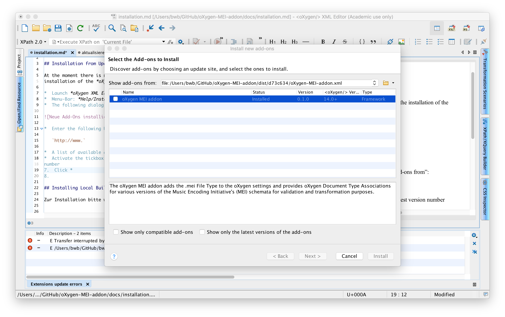

# Installation

## Installation from Update Site

At the moment there is no update site publicly available for the installation of the *oXygen MEI Addon*.

1.  Launch *oXygen XML Editor*
2.  Menu-Bar: *Help/Install new add-ons…*

    

3.  The following dialog opens…

    

4.  Enter the following URL in the line labeled “Show add-ons from”:
   
   `http://www.` 
   
5.  A list of available add-ons appears

    

6.  Activate the tickbox adjacent to the entry with the highest version number
7.  Click *Next >*
8. On the next pane accept the license by activating the tickbox at the bottom
9. Click *Install >*
10.  A dialog opens with a warning about non-identified developers
11.  Click *Continue anyway*
12.  Another dialog appears telling you to restart *oXygen XML Editor*
13.  Click *OK*
14.  Quit an restart *oXygen XML Editor*
 
## Installing Local Build

Basically installing a local build follows the same procedure as installing from the update site, except that the URI entered in step 4 has to `oXygen-MEI-addon.xml` file in your local build folder.